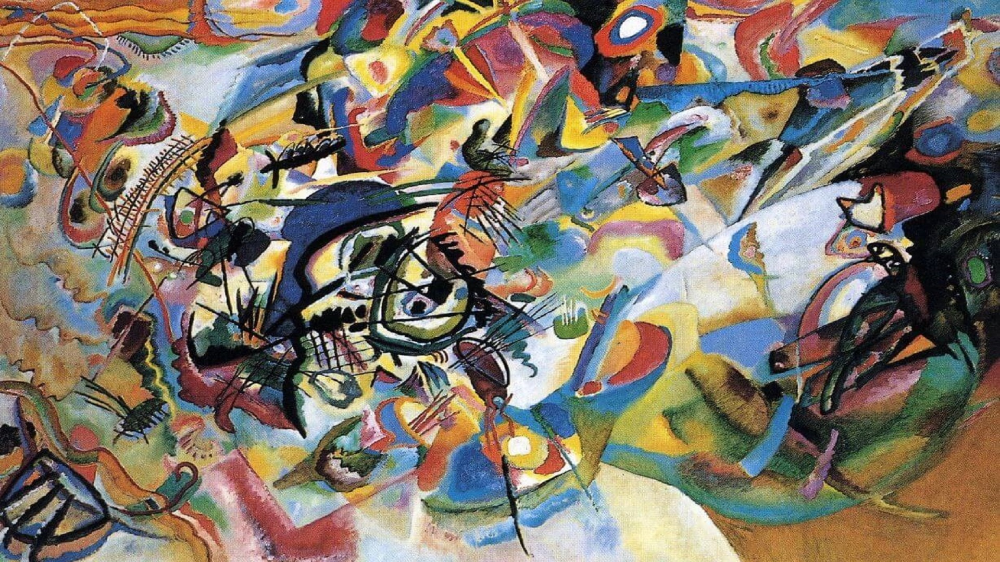
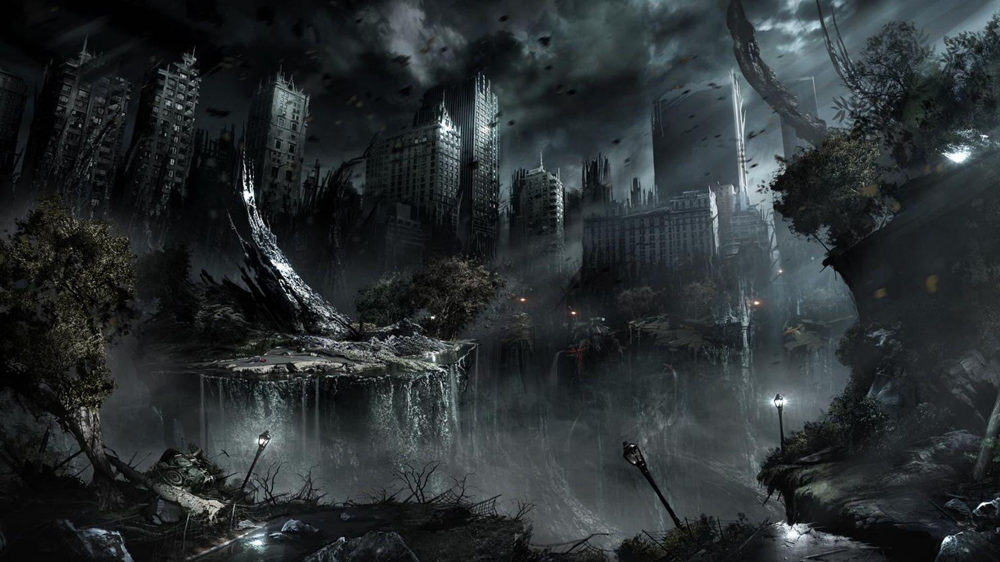

# ptNST

### Useful information:

- **PyTorch (including base NST)**
- **Pretrained VGG19**
- **content_layers_default = ['conv_4']**
- **style_layers_default = ['conv_1', 'conv_2', 'conv_3', 'conv_4', 'conv_5']**
- **num_steps=100**
- **style_weight=10000**
- **content_weight=1**

### Primary video used in experiments:

Original video link: https://www.youtube.com/watch?v=VGslOJC2sgQ
[0:04-0:06]

### Experiments:

