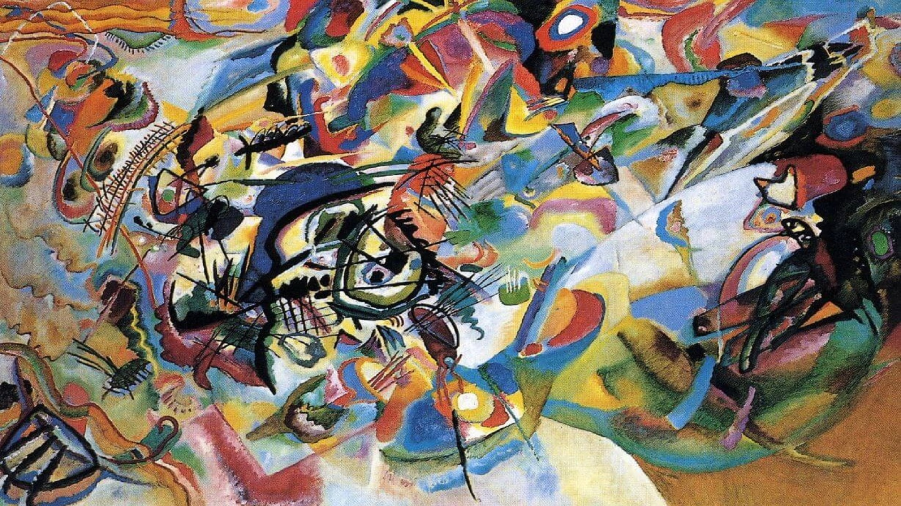

# ptNST

### Useful information:

- **PyTorch (including base NST)**
- **Pretrained VGG19**
- **content_layers_default = ['conv_4']**
- **style_layers_default = ['conv_1', 'conv_2', 'conv_3', 'conv_4', 'conv_5']**
- **content_weight=1**

###Note:
All images which are used as style are random taken from internet and has not been created or modified (except resolution) by project author.

### Primary video used in experiments:

Original video link: https://www.youtube.com/watch?v=VGslOJC2sgQ
[0:04-0:06]

### Experiments:
## style_weight=10000

</img>
</img>

</img>
</img>

</img>
</img>

</img>
</img>

</img>
</img>

</img>
</img>

</img>
</img>

</img>
</img>

</img>
</img>

</img></img>
</img>

</img>
</img>

</img>
</img>
